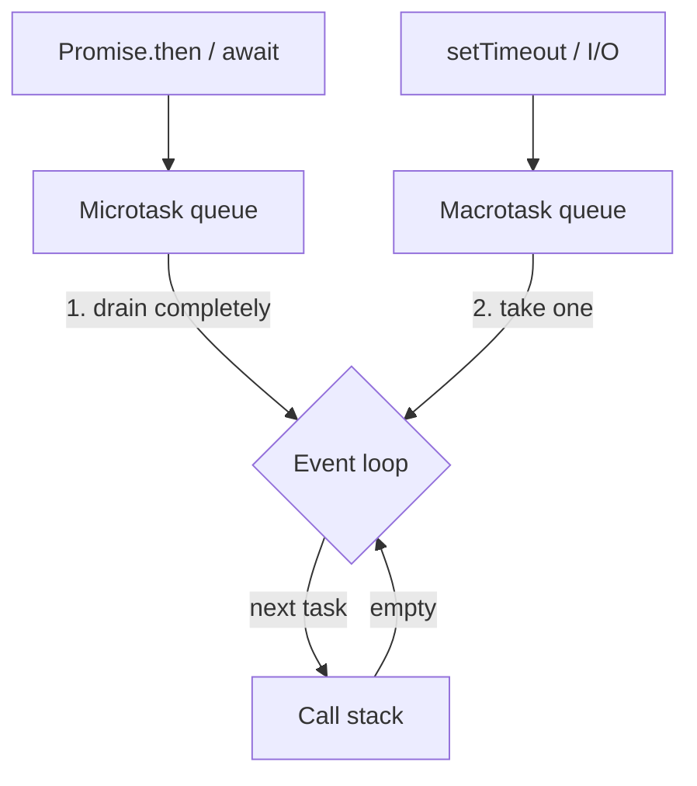
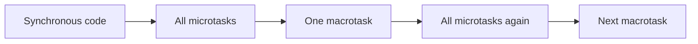
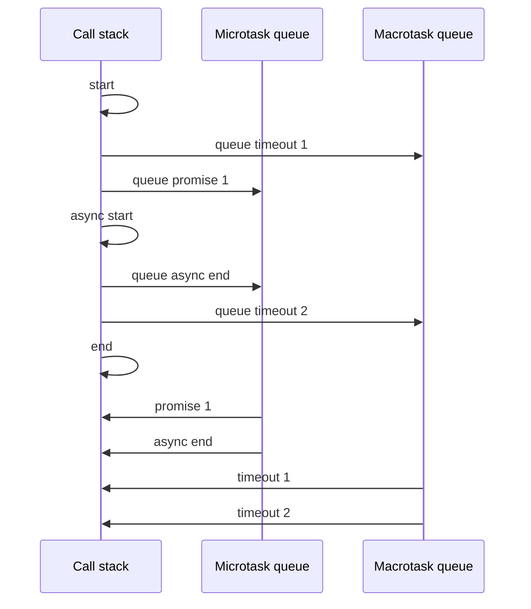

Last year I failed an interview at ByteDance. I thought I had mastered JavaScript. I could define every React hook, explain virtualization, talk about reconciliation, and solve a medium LeetCode problem. Then the interviewer show a tiny snippet of plain JavaScript and asked me to write down the exact order of the output.

---

## The problem

The question was basically this: given a piece of code with some synchronous calls and some async ones mixed together, what is the printed order?

This is not the exact snippet I got, you can find a hundred versions of this question anywhere, but it reflects the same concept:

```js
console.log("start");

setTimeout(() => console.log("timeout 1"), 0);

Promise.resolve().then(() => console.log("promise 1"));

(async () => {
  console.log("async start");
  await null;
  console.log("async end");
})();

setTimeout(() => console.log("timeout 2"), 0);

console.log("end");
```

---

## What the event loop actually is

JavaScript runs on a single thread. One call stack, one thing at a time. So the question is not "how does JavaScript do many things at once", because it cannot. The question is "when the stack is empty, what does it pick up next?"

That is the event loop's entire job. It sits between the call stack and a few queues of pending work, and it follows one rule: run whatever is on the stack until the stack is empty, then take the next piece of work from a queue, put it on the stack, and repeat.



Two details in that diagram do all the work later:

- The loop only looks at a queue when the call stack is **empty**. Synchronous code is never interrupted.
- The microtask queue is drained **completely**, and only then does one macrotask get to run.

---

## The three kinds of work

Every line in that snippet falls into one of three buckets.

### 1. Synchronous

Plain code. It runs immediately, on the current call stack, in the order it is written. Nothing can jump ahead of it.

```js
console.log("a");
console.log("b"); // always after "a", no exceptions
```

The body of an `async` function is also synchronous, up to its first `await`. That part surprises a lot of people, including me at the time.

### 2. Microtasks

Work scheduled by promises. `.then()`, `.catch()`, `.finally()`, everything after an `await`, and `queueMicrotask()`. They do not run inside the current stack, but they run as soon as it empties, before the browser renders, before any timer, before anything else.

```js
Promise.resolve().then(() => console.log("microtask"));
queueMicrotask(() => console.log("also a microtask"));
```

The queue is drained fully. If a microtask schedules another microtask, that new one also runs in the same drain, before any macrotask gets a turn.

### 3. Macrotasks

Work scheduled by the host environment: `setTimeout`, `setInterval`, I/O, DOM events, `setImmediate` in Node. One per loop iteration.

```js
setTimeout(() => console.log("macrotask"), 0);
```

`setTimeout(fn, 0)` does not mean "run now". It means "put this in the macrotask queue, and you are allowed to run it after at least 0ms". If the stack is busy for two seconds, it waits two seconds.

So the priority is simply:



---

## Walking through the snippet

Here is the same code again, with each line flagged by type:

```js
console.log("start");                                   // sync

setTimeout(() => console.log("timeout 1"), 0);          // macrotask

Promise.resolve().then(() => console.log("promise 1")); // microtask

(async () => {
  console.log("async start");                           // sync
  await null;
  console.log("async end");                             // microtask
})();

setTimeout(() => console.log("timeout 2"), 0);          // macrotask

console.log("end");                                     // sync
```

Two of each. Now the steps:

1. `console.log("start")` runs on the stack. Prints **start**.
2. `setTimeout(..., 0)` hands the callback to the host. It goes to the macrotask queue. Nothing prints.
3. `Promise.resolve()` is already resolved, so `.then()` schedules its callback on the microtask queue immediately. Nothing prints.
4. The async IIFE is called, and its body runs synchronously. Prints **async start**.
5. `await null` hits. Even though `null` is not a promise, `await` always yields: the rest of the function is wrapped up and queued as a microtask. The queue is now `[promise 1, async end]`.
6. The second `setTimeout` goes to the macrotask queue. It is now `[timeout 1, timeout 2]`.
7. `console.log("end")` runs. Prints **end**.
8. The script finishes and the call stack is empty. The event loop turns to the microtask queue and drains it: prints **promise 1**, then **async end**.
9. Microtasks are exhausted, so the loop takes **one** macrotask: prints **timeout 1**.
10. Stack is empty again, microtask queue is empty, so the loop takes the next macrotask: prints **timeout 2**.

Final output:

```text
start
async start
end
promise 1
async end
timeout 1
timeout 2
```

The same walkthrough, animated one step at a time:

<div className="not-prose bg-primary-900 border border-rockblue-900/40 rounded-md p-4">
  <video
    src="/demo/event-loop.mp4"
    poster="/demo/event-loop-poster.jpg"
    width="100%"
    controls
    loop
    muted
    playsInline
  />
</div>

It is a plain HTML page, so you can also [open it on its own](/demo/event-loop.html) and step through it at your own pace with the arrow keys.

As a sequence, the same thing:



---

## What I actually got wrong

My mistake was not the timers. Everybody knows `setTimeout` is "later". My mistake was assuming `await` also meant "later, roughly around the timers", and that the code before an `await` somehow already counted as async. It does not. An `async` function is ordinary synchronous code until the first `await`, and everything after that `await` is a microtask that beats every timer in the queue.

The lesson I took from that interview is uncomfortable but useful: being productive in a framework is not the same as understanding the language under it. React hooks, virtualization, memoization, those are all built on this loop. I had learned the top layer very well and skipped the floor it was standing on.
