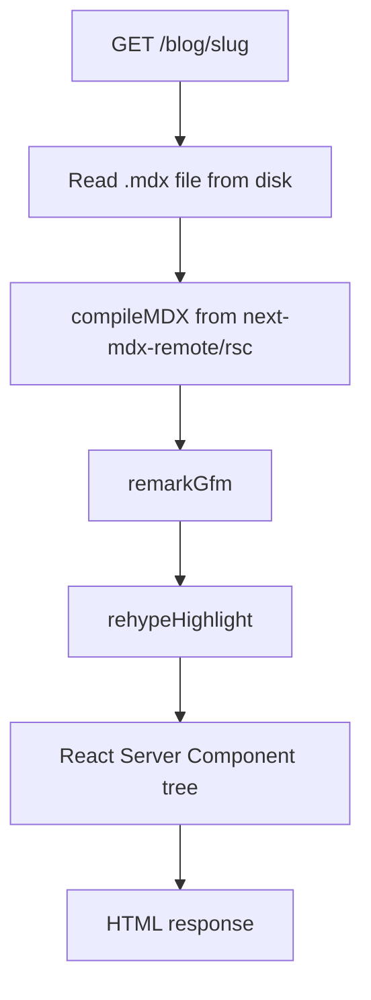
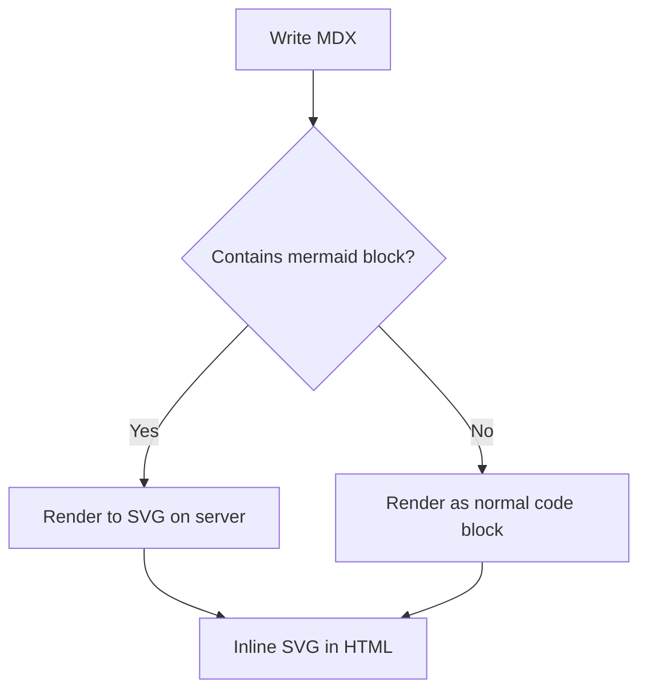

I wanted to be able to drop a fenced ` ```mermaid ` block into a blog post and have it show up as a real diagram. Nothing fancy, just a flowchart or sequence diagram here and there when prose isn't the right format.

The interesting part wasn't "how do I render Mermaid," it's "how do I render Mermaid **on the server**, at request time, without a headless browser." This post walks through how this blog's MDX pipeline works and how the Mermaid rendering fits into it.

## The existing pipeline

This blog is server-rendered MDX, not a static site generator with a build step. Every blog request compiles the `.mdx` file fresh:



The relevant bit lives in `src/modules/blog/blog.action.tsx`:

```ts
const { content, frontmatter } = await compileMDX<BlogFrontmatter>({
  source: page,
  options: {
    parseFrontmatter: true,
    mdxOptions: {
      remarkPlugins: [remarkGfm],
      rehypePlugins: [rehypeHighlight],
    },
  },
  components: MdxComponent,
});
```

`rehypeHighlight` walks the compiled HTML tree (a [hast](https://github.com/syntax-tree/hast) AST) and adds syntax-highlighting classes to code blocks. Adding Mermaid support meant writing a plugin that does the same kind of tree walk, but replaces `mermaid` code blocks with rendered SVG instead of just annotating them.

## Why not the obvious options

Mermaid's own renderer needs a DOM: it builds SVG through `d3`, measures text, lays out nodes. That works fine in a browser. It does not work in plain Node. Three ways around that:

1. **Client-side rendering.** Ship `mermaid.js` to the browser, render on mount. Simplest, but it means a JS bundle for every visitor and a flash of unstyled code block before hydration. Diagrams also wouldn't show up with JS disabled.
2. **Headless browser at build/request time** (`rehype-mermaid` with Playwright, or the Mermaid CLI). True server render, but Playwright is a ~300MB dependency and spinning up Chromium per request is slow — this blog compiles MDX on every request, not at build time, so that cost would be paid on every page load.
3. **A fake DOM in Node**, just enough for Mermaid to think it's in a browser. No real browser process, pure JS.

Option 3 is what [`isomorphic-mermaid`](https://github.com/tani/isomorphic-mermaid) does — it wires up `svgdom`, `jsdom`, and `dompurify` into a minimal `window`/`document` and hands that to Mermaid. That fits this blog's request-time compilation model much better than spinning up a browser per request.

## The plugin

A rehype plugin is just a function that gets a hast tree and mutates it. The shape I needed:

```text
for each <pre><code class="language-mermaid"> in the tree:
  extract the diagram source text
  svg = mermaid.render(source)
  replace the <pre> node with a <div><svg>...</svg></div>
```

In real code (`src/libs/rehype-mermaid.ts`), using `unist-util-visit` to walk the tree and `hast-util-to-string` to pull text out of the code node:

```ts
const rehypeMermaid = () => {
  return async (tree: Root) => {
    const nodes: { node: Element; index: number; parent: Root | Element }[] = [];

    visit(tree, "element", (node, index, parent) => {
      const isMermaidBlock =
        node.tagName === "pre" &&
        node.children[0]?.type === "element" &&
        node.children[0].tagName === "code" &&
        (node.children[0].properties?.className as string[])?.includes("language-mermaid");

      if (isMermaidBlock && typeof index === "number" && parent) {
        nodes.push({ node, index, parent });
      }
    });

    for (const { node, index, parent } of nodes) {
      const code = toString(node.children[0]);
      const { svg } = await mermaid.render(`diagram-${id++}`, code);
      parent.children[index] = wrapInStyledDiv(svg);
    }
  };
};
```

Two things worth calling out:

- **Collect matches first, mutate after.** Mutating `parent.children` while `visit` is still walking it shifts indices around and skips nodes. Two passes avoids that entirely.
- **`await` inside the loop, not `Promise.all`.** Mermaid's renderer isn't safe to call concurrently against a single fake DOM (more on that below), so diagrams render one at a time.

Wired into the existing pipeline, it just slots in before the highlighter:

```ts
rehypePlugins: [rehypeMermaid, rehypeHighlight],
```

Order matters here — `rehypeMermaid` needs to replace the mermaid code block with an SVG *before* `rehypeHighlight` gets a chance to try syntax-highlighting it as code.

## Sandboxing the fake DOM

`isomorphic-mermaid` works by assigning its sandboxed `window`/`document` onto `globalThis` when you import it, so Mermaid's browser-oriented code has something to call into. That's convenient, but a Next.js server process runs a lot of other code alongside it, and some of that code checks `typeof window !== "undefined"` to decide whether it's running in a browser. Leaving the fake globals in place permanently would make all of that code think it's client-side when it isn't.

The fix is to treat the fake globals as scoped state rather than permanent ones: capture what the import assigns, restore the real server environment right away, and only swap the fake `window`/`document` back in for the duration of an actual `render()` call:

```ts
const savedWindow = globalThis.window;
const savedDocument = globalThis.document;

const { default: mermaid } = await import("isomorphic-mermaid");

// capture what the import just assigned to globalThis
const mermaidWindow = globalThis.window;
const mermaidDocument = globalThis.document;

// then immediately give the real server environment back
globalThis.window = savedWindow;
globalThis.document = savedDocument;

async function renderMermaid(id: string, code: string) {
  globalThis.window = mermaidWindow;
  globalThis.document = mermaidDocument;
  try {
    return await mermaid.render(id, code);
  } finally {
    globalThis.window = savedWindow;
    globalThis.document = savedDocument;
  }
}
```

Since this blog can compile several MDX files concurrently (the blog index page maps `Promise.all` over every post), two `renderMermaid` calls racing would stomp on each other's global state. A tiny promise queue serializes them:

```ts
let renderQueue: Promise<unknown> = Promise.resolve();

const renderMermaid = (id: string, code: string) => {
  const run = renderQueue.then(() => renderWithSandboxedGlobals(id, code));
  renderQueue = run.catch(() => {});
  return run;
};
```

## Matching the site's theme

By default Mermaid renders light-mode diagrams — white nodes on a white-ish background, which looked out of place against this site's dark navy. Mermaid exposes a `theme: "base"` mode plus a `themeVariables` object for exactly this: point every color at the same Tailwind tokens (`primary`, `rockblue`, `spray`) the rest of the site already uses.

```ts
mermaid.initialize({
  theme: "base",
  themeVariables: {
    background: "#10203A",       // primary-900
    primaryColor: "#10203A",     // node fill
    primaryBorderColor: "#4A4E65", // rockblue-900
    primaryTextColor: "#F4F6F9", // rockblue-50
    nodeBorder: "#5FE9D2",       // spray-300, same accent as headings
    lineColor: "#7C83AF",        // rockblue-600
    // ...
  },
});
```

The rendered SVG then gets wrapped in the same bordered container this blog already uses for code blocks, so a diagram reads as "part of the article" instead of a foreign embed:

```ts
{
  type: "element",
  tagName: "div",
  properties: {
    className: ["not-prose", "bg-primary-900", "border", "border-rockblue-900/40", "rounded-md", "p-4"],
  },
  children: [svgElement],
}
```

## Result

A fenced code block:

````md

````

becomes this, compiled to a static SVG on the server before the response ever reaches your browser:


No client-side Mermaid bundle, no Playwright, no build step — just a rehype plugin, a fake DOM, and two globals put back where they belong.
